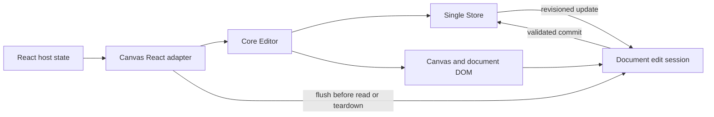

# React Frontend Audit and Implementation Plan

**Project:** Incantly Canvas
**Package:** `@incantly/canvas-react`
**Reviewed:** 19 September 2026
**Revision:** `ca2d296` on `feature/continuous-width-dual-eraser`
**Status:** Implemented and verified on 20 September 2026.

## Implementation update

All audit workstreams are now represented in the implementation:

- Rich-text DOM construction and hostile snapshot handling were hardened (R-01).
- Deferred edits flush across snapshots, teardown, page operations, and readonly transitions (R-02).
- Focused local drafts use a store fingerprint, emit `documentconflict`, and require an explicit local/remote resolution when revisions diverge (R-03).
- Live readonly transitions update the document editing surface and accessibility state (R-04).
- React props now have a documented live/initial contract, typed callbacks, safe snapshot ref methods, and separate fit-on-mount/fit-on-resize behavior (R-05, R-06, R-10, R-11).
- The playground uses mobile drawers below 900 px, toolbar controls have consistent accessible names/state, and SDK CSS no longer loads Google Fonts (R-07, R-08, R-09).

Verification after implementation: **41 test files / 435 tests passed**, core/React/React Native TypeScript builds passed, the playground production build passed, and `git diff --check` passed.

The follow-up release-hardening work now includes automated React Strict Mode, SSR, accessibility-contract, and conflict-event coverage. Performance work is governed by [`PERFORMANCE_PLAN.md`](PERFORMANCE_PLAN.md), which adapts tldraw's culling, batching, caching, level-of-detail, and measurement guidance to this Canvas 2D renderer.

## Executive assessment

The web architecture is fundamentally sound: the framework-free core owns the editor and store, while the React package is a small lifecycle adapter. This is the right boundary and should be preserved.

The immediate problem is that the adapter and the DOM document editor do not yet form a reliable controlled component. A pending keystroke can be lost during unmount, a focused document can overwrite an incoming remote change, and switching to `readonly` at runtime can leave the document editable. Snapshot text styles also accept an arbitrary color identifier that is interpolated into HTML, which allows markup injection when untrusted documents are loaded.

The best approach is to harden the shared document boundary first, then formalize which React props are live and which are initialization-only, and only after that improve the shell and toolbar design. Cosmetic work before the first two phases would polish behavior that is still capable of losing or corrupting data.

## What was reviewed

- React adapter and public types: [`packages/react/src/index.tsx`](packages/react/src/index.tsx), [`packages/react/src/types/index.ts`](packages/react/src/types/index.ts)
- React tests and package metadata
- Core editor lifecycle, document UI, rich-text validation/serialization, toolbar, store, and version history
- React demo and feature playground
- Public React documentation and package README
- Desktop browser rendering and a 390 × 844 responsive viewport
- Current uncommitted ink/eraser work was inspected but not modified

## Verification baseline

| Check | Result |
| --- | --- |
| Full Vitest suite | **Pass:** 39 files, 407 tests |
| Package TypeScript checks | **Pass:** core, React, React Native |
| Package build | **Pass:** core, React, React Native |
| Playground production build | **Pass:** 408.57 kB JS / 126.60 kB gzip |
| React demo production build | **Pass:** 377.31 kB JS / 117.89 kB gzip |
| Local browser smoke test | **Pass** at desktop size; responsive shell failure at phone size |
| Focused audit probes | **5 web defects reproduced**; temporary probes were removed after the audit |

Passing tests currently show that the happy paths work. They do not cover the failure modes below.

## Findings by priority

### P0 — fix before accepting untrusted snapshots or shipping collaborative editing

#### R-01: Rich-text color can inject markup into the document DOM

**Evidence:** [`packages/core/src/rich-text/document.ts:65`](packages/core/src/rich-text/document.ts:65) accepts any string as `span.color`. [`packages/core/src/rich-text/dom.ts:29`](packages/core/src/rich-text/dom.ts:29) inserts that value into a quoted `style` attribute.

A crafted snapshot can close the CSS value and attribute, then inject another element. The audit reproduced this by loading a malicious color string and observing the injected element in the generated DOM.

**Recommended change:**

1. Validate colors against `COLOR_IDS` during snapshot normalization. Invalid values should be omitted or mapped to `black`.
2. Stop generating rich-text DOM with HTML strings. Build elements and assign `textContent`, `style`, and attributes through DOM APIs.
3. Sanitize link schemes to an explicit allowlist such as `https:`, `http:`, `mailto:`, and `tel:`. Add `rel="noopener noreferrer"` for links that open a new context.
4. Add hostile-snapshot tests for color, font, font size, link URL, link title, and image attributes.

**Acceptance:** Loading arbitrary JSON cannot create a node, event attribute, executable URL, or CSS declaration that was not represented by a validated model field.

#### R-02: The final document edit can be lost when React unmounts the canvas

**Evidence:** document input is deferred with `requestAnimationFrame` in [`packages/core/src/page-document-ui.ts:415`](packages/core/src/page-document-ui.ts:415). `destroy()` cancels the frame at [`packages/core/src/page-document-ui.ts:258`](packages/core/src/page-document-ui.ts:258) instead of flushing it. The React cleanup then destroys the editor at [`packages/react/src/index.tsx:147`](packages/react/src/index.tsx:147).

The audit reproduced an edit followed by immediate unmount; the external `Store` never received the last text.

**Recommended change:** add a public `flushPendingEdits()` boundary and call it before page changes, snapshot reads, store replacement, unmount, visibility changes, and destructive commands. `PageDocumentUI.destroy()` should flush unless the editor is explicitly aborting an invalid transaction.

**Acceptance:** type and immediately navigate/unmount/save; the final character is present in the store and exported snapshot every time.

#### R-03: A focused editor can overwrite a newer remote update

**Evidence:** the core store listener deliberately skips DOM synchronization while the page editor is focused at [`packages/core/src/editor.ts:535`](packages/core/src/editor.ts:535). A later local sync writes the stale DOM back to the store.

This is a data conflict, not just a display delay. It affects the advertised shared-store and future collaboration model.

**Recommended change:** introduce a document edit session with a base revision or fingerprint. When a remote diff changes the active document during local editing, either:

- merge block-level changes when they do not overlap; or
- pause the local commit and emit a typed conflict event for the host.

At minimum, never silently replace a remote revision with stale DOM. Add two-editor tests using one `Store`.

**Acceptance:** editor A can remain focused while editor B or a remote diff changes the same page; neither version disappears silently.

#### R-04: Live `readonly` switching does not fully lock document mode

**Evidence:** the document element is always created with `contentEditable = 'true'` at [`packages/core/src/page-document-ui.ts:102`](packages/core/src/page-document-ui.ts:102). [`Editor.setReadonly()`](packages/core/src/editor.ts:1129) does not update `contentEditable`, document layout, focus, formatting UI, or pointer behavior.

The audit reproduced `false → true` through React props and then changed the store through the still-editable document element.

**Recommended change:** add `PageDocumentUI.setReadonly(readonly)` and make it set `contentEditable`, `aria-readonly`, tab/focus behavior, selection toolbar visibility, paste/input guards, and layout. Call it from construction and every `Editor.setReadonly()` transition.

**Acceptance:** the same behavior is observed whether `readonly` is true at mount or becomes true later; keyboard, paste, drop, toolbar, and pointer edits are blocked while pan/zoom and text selection follow the chosen read-only policy.

### P1 — stabilize before the next public minor release

#### R-05: Most React props are captured only at mount without a clear contract

The editor creation effect depends only on `store` at [`packages/react/src/index.tsx:151`](packages/react/src/index.tsx:151). Theme, grid, readonly, UI visibility, and two document colors have update effects. The following do not update after mount:

- `documentMode`
- `snapshot`
- `camera`
- `styles`
- `watermark`
- `uiTools` and `uiIcons`
- `hidePagesBar`
- `touchUi`
- `documentUi`
- `autoFit` setup/teardown

The audit reproduced a `documentMode` prop change that left the existing editor in board mode.

**Recommended change:** classify every prop as `live`, `initial`, or `replace-editor` and encode that classification in the API name and docs. Prefer live setters for UI options and visual configuration. Rename initialization-only values to `initialSnapshot`, `initialCamera`, and `initialStyles`. If `documentMode` remains immutable, remount on an explicit `key` and document that requirement.

Also update the UI options effect to include `hidePagesBar`, tools, and icons where supported.

#### R-06: `autoFit` can fight the user’s camera

When enabled, every host resize calls `resize()` and `fitContent()` at [`packages/react/src/index.tsx:129`](packages/react/src/index.tsx:129). Toolbars, side panels, mobile browser chrome, or layout animations can therefore reset a camera the user just positioned.

**Recommended change:** split this into `fitOnMount` and `fitOnResize`, debounce resize fitting, and disable resize fitting after direct user camera input unless the host opts into continuous fitting.

#### R-07: The playground shell is unusable at phone width

The playground uses fixed 240 px and 320 px sidebars in [`apps/playground/src/App.tsx:61`](apps/playground/src/App.tsx:61) and [`apps/playground/src/App.tsx:79`](apps/playground/src/App.tsx:79). At a 390 px viewport, the canvas is completely outside the visible area.

**Recommended design:**

- Under 900 px, turn feature navigation and debug data into drawers.
- Keep the canvas as the full viewport work surface.
- Use one compact bottom toolbar with horizontal overflow.
- Put page controls at the top center and expose debug state through a floating developer button.
- Respect safe-area insets and keep touch targets at least 44 × 44 px.

This is a playground issue, but the playground is the main QA surface and currently cannot validate web touch behavior.

#### R-08: Toolbar accessibility and keyboard navigation are incomplete

Many icon buttons rely on `title`; only some receive `aria-label`. Popovers and the slash menu need consistent roles, focus movement, escape handling, and focus restoration.

**Recommended change:** create one button factory that always supplies accessible name, pressed/selected state, disabled state, tooltip, and roving keyboard focus. Test the toolbar, menus, page bar, and selection bubble with keyboard-only navigation and an accessibility checker.

#### R-09: The core stylesheet imports fonts from Google at runtime

[`packages/core/src/canvas.css:7`](packages/core/src/canvas.css:7) makes a network request on import. This weakens offline behavior, exposes user requests to a third party, and can cause font/layout shifts.

**Recommended change:** remove the remote import from the SDK CSS. Use system stacks by default and provide an optional self-hosted font asset entry point or documented host override.

### P2 — maintainability and release quality

#### R-10: The React wrapper hides type problems with `any`

The editor constructor and callbacks use several `as any` / `any` values even though the core exports the relevant types. This weakens the adapter at the exact public boundary TypeScript should protect.

**Recommended change:** export a public `EditorOptions` type, type every callback from the core API, and add API-extractor or declaration-shape checks so package changes cannot silently drift.

#### R-11: Documentation does not cover lifecycle and conflict behavior

The React docs explain basic props but do not explain initialization-only fields, Strict Mode, store replacement, pending edit flushing, SSR/client-only use, error handling, or collaborative conflict semantics.

**Recommended change:** add “Lifecycle”, “Controlled state”, “Persistence”, “SSR”, and “Collaboration” sections with tested examples.

## Recommended architecture

The store remains the source of truth. The document DOM may keep a short-lived editing draft, but that draft must have a revision, an explicit flush operation, and a defined conflict path. The React adapter should translate React lifecycle changes into typed editor setters; it should not recreate document state independently.

## Implementation order

### Phase 1 — security and data integrity

1. Validate every rich-text enum and URL; replace unsafe HTML-string construction.
2. Add `flushPendingEdits()` and use it on teardown, save, page switch, store switch, and snapshot read.
3. Add revision-aware focused editing and a conflict event.
4. Implement complete read-only transitions.
5. Add regression tests for all four areas.

**Exit gate:** hostile snapshots are inert; last-keystroke, remote-update, and readonly regression tests pass.

### Phase 2 — React contract

1. Publish the live/initial/replace classification for every prop.
2. Rename initialization-only props in a deprecation cycle.
3. Add missing core/UI setters or intentionally remount for structural changes.
4. Remove adapter `any` casts and add typed error reporting.
5. Test prop transitions under `StrictMode`.

**Exit gate:** every public prop has a test proving either live behavior or documented initialization-only behavior.

### Phase 3 — responsive and accessible UX

1. Make the playground canvas-first below 900 px.
2. Consolidate toolbar button semantics and keyboard behavior.
3. Add reduced-motion, high-contrast, safe-area, and touch-target checks.
4. Remove the runtime font request.

**Exit gate:** desktop, tablet, and 390 px phone layouts keep the canvas usable; keyboard and screen-reader smoke tests pass.

### Phase 4 — performance and release validation

1. Add a performance fixture with 1,000 shapes, 100 text blocks, and multiple pages.
2. Track interaction FPS, input latency, heap growth across mount/unmount, and bundle size.
3. Add Playwright coverage for draw, type, page switch, undo/redo, snapshot reload, read-only mode, and two shared views.

**Suggested budgets:** pointer-to-paint under 16 ms at p95 on a current laptop; text input under 50 ms at p95; no detached editor nodes after repeated mount/unmount; React adapter adds no avoidable runtime dependency.

## Definition of done

- All P0 and P1 findings have regression tests.
- Snapshot validation rejects or normalizes every out-of-domain value.
- Snapshot reads and teardown always include pending edits.
- Remote updates never disappear silently during a focused edit.
- `readonly` is identical at mount and after a prop transition.
- Every public prop and ref method either works or is removed/deprecated.
- The playground remains usable from 390 px through desktop widths.
- CI runs unit, type, package build, browser integration, and accessibility smoke checks.

## Files most likely to change

- `packages/core/src/rich-text/document.ts`
- `packages/core/src/rich-text/dom.ts`
- `packages/core/src/page-document-ui.ts`
- `packages/core/src/editor.ts`
- `packages/react/src/index.tsx`
- `packages/react/src/types/index.ts`
- `packages/react/test/canvas.test.tsx`
- `apps/playground/src/App.tsx`
- `apps/docs/content/react.mdx`
