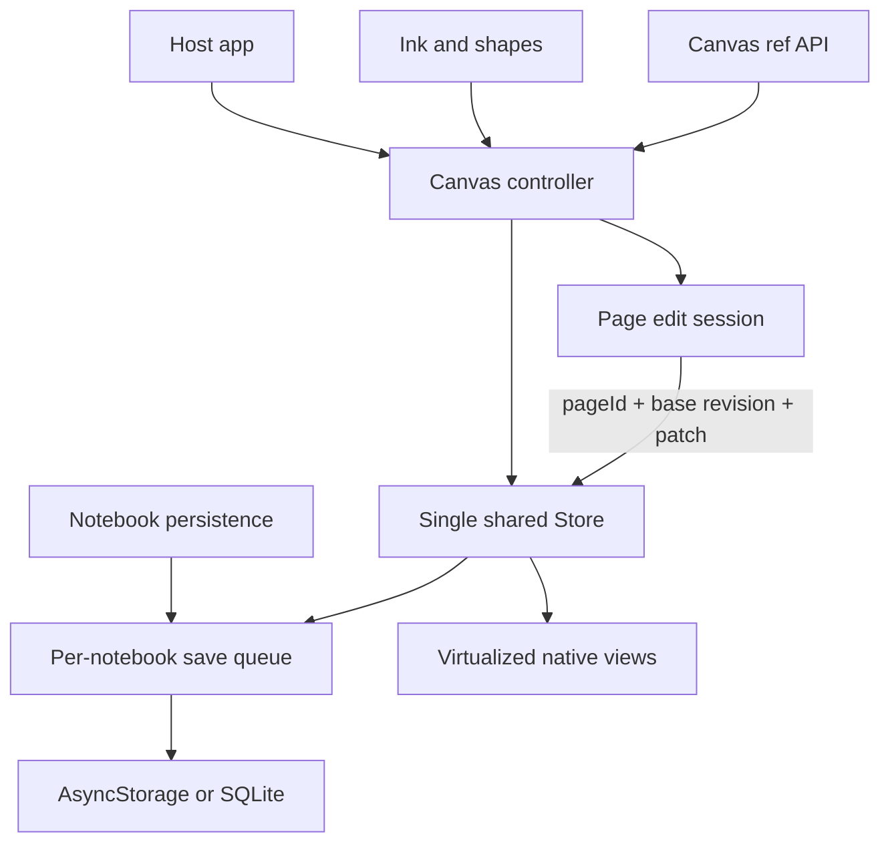

# React Native Audit and Implementation Plan

**Project:** Incantly Canvas
**Package:** `@incantly/canvas-react-native`
**Reviewed:** 19 September 2026
**Revision:** `ca2d296` on `feature/continuous-width-dual-eraser`
**Status:** The native renderer and shared headless model are a promising base, but several reproducible state and persistence bugs can overwrite edits. The package’s documented public API is also substantially ahead of the implementation.

## Executive assessment

The decision to use a shared headless store with native React Native views, `react-native-svg`, and a native text editor is the right long-term design. Snapshot compatibility with web should remain the central constraint.

The current implementation has two competing writable representations for page text: `localBlocks` in React state and the shared `Store`. A 300 ms delayed write reads the *current* page ID rather than the page that originated the edit. This allows text from one page to overwrite another page and allows delayed text to erase a newer ink stroke. Snapshot reads can also return stale text. These are release blockers.

The best approach is to remove the second writable document copy, or strictly contain it in a page-scoped edit session with a base revision. All page changes, ink commits, snapshot reads, persistence saves, undo/redo, and unmounts must pass through the same flush/transaction coordinator.

## What was reviewed

- Native `Canvas`, board and document viewports, ink, shapes, text, toolbar, and minimap
- Store hook, imperative bridge, notebook persistence, SQLite version storage, and version manager
- Native package tests and standalone Expo demo
- Public types, README, docs, roadmap, and obsolete WebView artifacts
- Current uncommitted continuous-width and dual-eraser work, preserved unchanged

## Verification baseline

| Check | Result |
| --- | --- |
| Full Vitest suite | **Pass:** 39 files, 407 tests |
| React Native package typecheck | **Pass** |
| Standalone Expo demo typecheck | **Pass** |
| React Native package build | **Pass** |
| Device/simulator end-to-end suite | **Not present** |
| Focused audit probes | **10 native/state defects reproduced**; temporary probes were removed after the audit |

## Findings by priority

### P0 — data-loss and unusable-API blockers

#### RN-01: A delayed edit from page A can overwrite page B

**Evidence:** text is queued without a page ID at [`packages/react-native/src/index.tsx:378`](packages/react-native/src/index.tsx:378). When it runs, `writeStore()` reads `currentPageIdRef.current` at [`packages/react-native/src/index.tsx:349`](packages/react-native/src/index.tsx:349). `selectPage()` changes that ref without flushing the old page at [`packages/react-native/src/index.tsx:432`](packages/react-native/src/index.tsx:432).

**Reproduction:** edit page A, select page B within 300 ms, wait. Page B receives A’s text.

**Recommended change:** queue `{ pageId, blocks, baseRevision }`, not just blocks. Flush or cancel the exact session before changing pages. Reject a commit if the target page revision changed, then merge or surface a conflict.

#### RN-02: A delayed text commit can erase a newer ink stroke

**Evidence:** ink commits directly to the store and then refreshes local blocks. A previously scheduled text callback still holds an older block array and later replaces the whole page document.

**Reproduction:** type, draw before the 300 ms timer fires, wait. The drawing block disappears.

**Recommended change:** serialize text and ink mutations through one page transaction coordinator. Prefer block-level operations over whole-document replacement. A text commit should patch only text blocks against the current store revision and preserve new drawing/image blocks.

#### RN-03: `getSnapshot()` can return stale text

**Evidence:** the ref reads the store immediately at [`packages/react-native/src/store/store-bridge.ts:155`](packages/react-native/src/store/store-bridge.ts:155), while text may still exist only in `localBlocks` for 300 ms.

This makes “Save” unreliable even when the host correctly awaits `getSnapshot()`.

**Recommended change:** make `getSnapshot`, persistence save, version checkpoint, page navigation, undo/redo, load/revert, backgrounding, and unmount call the same awaited `flushPendingEdits()` first.

#### RN-04: React Strict Mode can permanently disable text persistence

**Evidence:** the debounce object is created once with `useRef` at [`packages/react-native/src/index.tsx:378`](packages/react-native/src/index.tsx:378). Effect cleanup disposes it at line 385. Development Strict Mode replays effect setup/cleanup while preserving the ref, so the component retains a disposed callback.

The audit reproduced edits that never reached the store after a Strict Mode mount.

**Recommended change:** create the scheduler inside the effect/session and assign it to a ref, or make cleanup cancel pending work without permanently disposing an object reused by the next setup. Add a `StrictMode` regression test.

#### RN-05: Imperative page navigation does not update the displayed page

**Evidence:** `CanvasRef.setPage()` changes only `currentPageIdRef` in [`packages/react-native/src/store/store-bridge.ts:132`](packages/react-native/src/store/store-bridge.ts:132). Rendering is driven by React state in [`packages/react-native/src/index.tsx:219`](packages/react-native/src/index.tsx:219).

The audit reproduced a successful `setPage(pageB)` call while page A remained active.

**Recommended change:** route all imperative navigation through the same `selectPage()` action used by UI controls. The bridge should never mutate UI-owned refs directly.

#### RN-06: `clear()` removes the notebook and every page, leaving the canvas without a mutation target

**Evidence:** the bridge calls `store.clear()` at [`packages/react-native/src/store/store-bridge.ts:119`](packages/react-native/src/store/store-bridge.ts:119). The store clear operation removes all records, including notebook/page records.

After this call, a pen stroke has no page and is ignored.

**Recommended change:** define public semantics explicitly:

- `clearPage()` removes page content but preserves the page; or
- `clearDocument()` resets to a normalized notebook with one empty page.

Do not expose raw store destruction as the default canvas clear action.

#### RN-07: Persistence coalescing can leave returned promises unresolved

**Evidence:** `createSerialQueue()` stores only one pending task and its resolvers at [`packages/core/src/utils/async/serial-queue.ts:10`](packages/core/src/utils/async/serial-queue.ts:10). A third enqueue replaces the second task and loses its resolve/reject callbacks.

The audit reproduced a dropped task whose promise remained pending after the queue drained. Any host awaiting that save can hang indefinitely.

**Recommended change:** when coalescing, explicitly settle superseded callers with the result of the newest task, or return a documented coalesced status. Test three or more rapid calls, failures, and disposal.

#### RN-08: Persistence deduplication is shared across notebook IDs

**Evidence:** [`packages/react-native/src/storage/notebook-persistence.ts:23`](packages/react-native/src/storage/notebook-persistence.ts:23) stores one `lastSavedFingerprint`. Saving identical content to notebook A and then notebook B skips B’s write.

**Recommended change:** use `Map<notebookId, fingerprint>` and scope queues by notebook or include notebook ID in every queued operation. `load` and `delete` should update only that notebook’s entry.

#### RN-09: Much of the declared `Canvas` API is ignored or implemented as a no-op

The public type declares theme, grid, background colors, UI options, callbacks, safe-area insets, and bridge methods. The native `Canvas` destructures only a subset at [`packages/react-native/src/index.tsx:165`](packages/react-native/src/index.tsx:165). The bridge silently no-ops `setDocumentBackground`, `setDocumentPaperColor`, `setGrid`, `fitContent`, `focusPageDocument`, and `refreshPageDocument` at [`packages/react-native/src/store/store-bridge.ts:102`](packages/react-native/src/store/store-bridge.ts:102). `exportPng()` always returns `null`.

`onSelectionChange`, `onThemeChange`, `onGridChange`, `onEdit`, `onKeyboard`, `onSave`, `onPromptLink`, and `onReadClipboard` are declared but not wired. Theme rendering is hardcoded to light in the SVG layers.

**Recommended change:** produce a contract matrix and choose one outcome for every member: implement, throw a typed `UnsupportedOperationError`, or remove/deprecate it. Silent success is the worst option because host applications cannot detect that nothing happened.

#### RN-10: Read-only mode still exposes mutating page controls

`PageViewport` receives active `onAddPage`, `onRemovePage`, `onPaperSize`, and `onPaperStyle` callbacks even when `readonly` is true. The audit reproduced adding a page from a read-only canvas.

**Recommended change:** hide or disable all mutating controls and guard every mutation at the action/controller layer. UI hiding alone is insufficient because ref calls must obey the same policy.

### P1 — product correctness and platform behavior

#### RN-11: The advertised enriched Markdown editor is never loaded

[`packages/react-native/src/document/PageRichTextEditor.tsx:67`](packages/react-native/src/document/PageRichTextEditor.tsx:67) sets `ENRICHED` permanently to `null`. The optional peer can be installed, but `isEnrichedMarkdownAvailable()` will always return false.

The fallback converts the whole page to plain lines. On edit it reparses plain text, turning headings into paragraphs and removing bold, links, and other marks. Its formatting operations also append all drawing/image blocks after all text, which can change block order.

**Recommended change:** make renderer selection explicit through an adapter or package entry point. If the enriched editor is absent, use a clearly labeled plain-text mode that preserves untouched model structure and disables unsupported formatting. Never imply full rich-text support while using a destructive fallback.

#### RN-12: Local React state duplicates the store’s document state

`localBlocks`, `localFpRef`, `lastFpRef`, and multiple synchronization effects make ownership hard to reason about. The reproduced text/page/ink races all stem from this split.

**Recommended change:** introduce `usePageEditSession(pageId)`:

- store snapshot + revision are the committed state;
- editor draft belongs to one immutable page ID;
- session exposes `updateDraft`, `flush`, `cancel`, and `resolveConflict`;
- all non-text mutations flush first or use mergeable block operations;
- switching page disposes one session before creating another.

#### RN-13: Board sizing uses the entire window instead of its container

[`packages/react-native/src/board/BoardViewport.tsx:125`](packages/react-native/src/board/BoardViewport.tsx:125) uses `useWindowDimensions()`. A canvas inside a split view, modal, nested navigator, or tablet pane can render and hit-test outside its actual bounds.

**Recommended change:** derive viewport dimensions from the canvas root `onLayout`. Use window dimensions only as an initial fallback.

#### RN-14: Document pages are all mounted at full detail

[`packages/react-native/src/document/PageViewport.tsx:314`](packages/react-native/src/document/PageViewport.tsx:314) maps every page into one `ScrollView`. Large notebooks will mount rich text and SVG content for every page.

**Recommended change:** use `FlatList`/`FlashList`-style virtualization or windowed manual mounting. Keep lightweight page placeholders outside the active window. Render the active page and nearby pages at full detail.

#### RN-15: Gesture ownership needs a formal state machine and device tests

Board pan/pinch, document scroll, selection, shapes, text inputs, ink, and eraser each own responders in different layers. `onPanResponderTerminationRequest: () => false` can make nested gesture handoff brittle. The roadmap promises stylus/palm behavior, but the native code primarily sees React Native responder events and has no device-level automated coverage.

**Recommended change:** define exclusive modes (`type`, `select`, `shape`, `ink`, `erase`, `hand`) and one gesture coordinator. Test finger, stylus, two-finger pan/pinch, keyboard open/close, nested navigation gestures, and interruption on real iOS and Android targets.

#### RN-16: New continuous-width/eraser API is only partially connected

The current branch adds width, radius, and eraser-mode props, but `InkToolbar` declares these values and callbacks without destructuring or rendering controls. The drawing path supports them; the default product UI does not yet expose them.

**Recommended change:** finish the control design as a compact expandable tool inspector. Keep the main rail limited to modes; show width/radius, color, and eraser mode only for the active tool. Persist the selected settings per tool.

### P2 — documentation, cleanup, and release engineering

#### RN-17: Public documentation describes the old WebView architecture

[`apps/docs/content/react-native.mdx`](apps/docs/content/react-native.mdx) tells users to install `react-native-webview`, claims the engine runs in a bundled HTML page, and says Expo Go is supported. The package README describes the native renderer and a dev-client requirement. Both cannot be correct.

Obsolete [`packages/react-native/src/webview-entry.ts`](packages/react-native/src/webview-entry.ts) and [`packages/react-native/scripts/build-html.mjs`](packages/react-native/scripts/build-html.mjs) also remain in the package.

**Recommended change:** choose the native renderer as the only v1 path, remove dead WebView code after a migration check, and rewrite docs from the tested compatibility matrix.

#### RN-18: CI does not validate the standalone Expo demo or a native runtime

The demo is intentionally outside npm workspaces, so the root CI’s workspace typecheck does not cover it. There is no iOS/Android smoke build or component/device test.

**Recommended change:** add explicit demo typecheck and Expo diagnostics, then at least one Android emulator and one iOS simulator workflow on release branches. Keep fast headless unit tests for geometry and persistence.

## Recommended architecture

The controller is the only mutation gateway. The ref API and visible controls call the same actions. A page edit session may buffer keystrokes for performance, but the buffered value is tied to one page and revision. Persistence queues are per notebook and settle every caller.

## Recommended product design

### Document mode

- Full-screen paper stack with virtualized pages.
- Compact top app bar for notebook actions.
- Floating page stepper near the lower leading edge.
- Bottom tool rail for Type, Select, Pen, Highlighter, Eraser, Shapes, and Hand.
- Context inspector appears above the rail for color, width, fill, and eraser mode.
- Text formatting bar follows keyboard/safe-area position and only appears during text editing.

### Open canvas mode

- Canvas fills the measured component bounds.
- Minimap can collapse and is hidden while the keyboard is open.
- One-finger behavior follows the active tool; two fingers always navigate.
- Selection handles and hit targets stay at a constant screen size across zoom.

### Accessibility

- Every `Pressable` has role, label, selected/disabled state, and a 44 × 44 minimum hit area.
- Announce page changes, undo/redo results, tool changes, and storage errors.
- Support Dynamic Type for chrome while keeping canvas geometry stable.
- Respect reduced motion, high contrast, screen reader focus, and safe-area insets.

## Implementation order

### Phase 1 — stop data loss

1. Replace global delayed text writes with page-scoped revisioned edit sessions.
2. Flush before page/ref/persistence/version/lifecycle operations.
3. Serialize text with ink/shape mutations and preserve non-text blocks.
4. Fix Strict Mode scheduling.
5. Fix save queue settlement and per-notebook fingerprints.
6. Normalize `clear()` behavior.

**Exit gate:** regression tests cover page switching, immediate save, draw-during-typing, rapid save coalescing, multiple notebooks, clear/reset, unmount, and Strict Mode.

### Phase 2 — make the API truthful

1. Build a public prop/ref contract matrix.
2. Route every UI and imperative action through one controller.
3. Implement theme, grid, backgrounds, selection callbacks, safe area, and supported ref methods.
4. Remove, deprecate, or explicitly reject unsupported members such as PNG export.
5. Enforce read-only guards in the controller.

**Exit gate:** every public prop, callback, and ref method has a behavior test; no method silently no-ops.

### Phase 3 — text and rendering

1. Load enriched Markdown through an explicit adapter.
2. Preserve model structure in fallback mode.
3. Virtualize document pages.
4. Measure board/container layout locally.
5. Finish width/radius/eraser controls and per-tool state.

**Exit gate:** formatted text round-trips after editing; a 100-page notebook keeps a bounded mounted-view count; embedded/split canvases hit-test correctly.

### Phase 4 — gesture, accessibility, and device qualification

1. Centralize gesture ownership.
2. Add native accessibility semantics and announcements.
3. Test phone/tablet, portrait/landscape, keyboard, stylus, and low-memory lifecycle.
4. Remove WebView artifacts and align docs with tested versions.

**Exit gate:** representative iOS and Android device suites pass, including stylus/finger scenarios and app background/restore.

## Test matrix to add

| Area | Required cases |
| --- | --- |
| Edit session | page switch before debounce, save before debounce, unmount, Strict Mode, remote revision |
| Mixed content | type then draw, draw then type, image between text blocks, undo/redo across modes |
| Persistence | 3+ rapid saves, two notebook IDs, write failure, delete during queued save, app termination |
| Ref API | every method changes visible state or returns an explicit unsupported error |
| Read-only | toolbar, page controls, ref calls, text, shape, ink, paste |
| Gestures | finger, stylus pressure, palm/two-finger navigation, responder interruption |
| Layout | nested container, split view, rotation, safe area, keyboard, Dynamic Type |
| Scale | 100 pages, 1,000 shapes, long strokes, large snapshots, memory recovery |

## Definition of done

- No delayed operation can target a different page from the one that created it.
- Text commits cannot delete newer ink, shapes, images, or remote changes.
- Awaited snapshot/save/version calls include all visible edits.
- Every queued persistence promise settles.
- Notebook deduplication is scoped by notebook ID.
- Strict Mode and repeated mount/unmount preserve editing.
- Read-only mode blocks every mutation route.
- Every public API member is implemented, deprecated, or explicitly unsupported.
- Rich formatting survives ordinary fallback/editor round-trips.
- Page rendering is virtualized and canvas size comes from its container.
- Docs, README, package dependencies, and actual renderer architecture agree.
- CI checks the standalone Expo demo and representative native runtimes.

## Files most likely to change

- `packages/react-native/src/index.tsx`
- `packages/react-native/src/store/store-bridge.ts`
- `packages/react-native/src/store/use-canvas-store.ts`
- `packages/react-native/src/storage/notebook-persistence.ts`
- `packages/core/src/utils/async/serial-queue.ts`
- `packages/react-native/src/document/PageRichTextEditor.tsx`
- `packages/react-native/src/document/PageViewport.tsx`
- `packages/react-native/src/board/BoardViewport.tsx`
- `packages/react-native/src/ink/InkToolbar.tsx`
- `packages/react-native/src/types/index.ts`
- `apps/docs/content/react-native.mdx`
- `.github/workflows/ci.yml`
